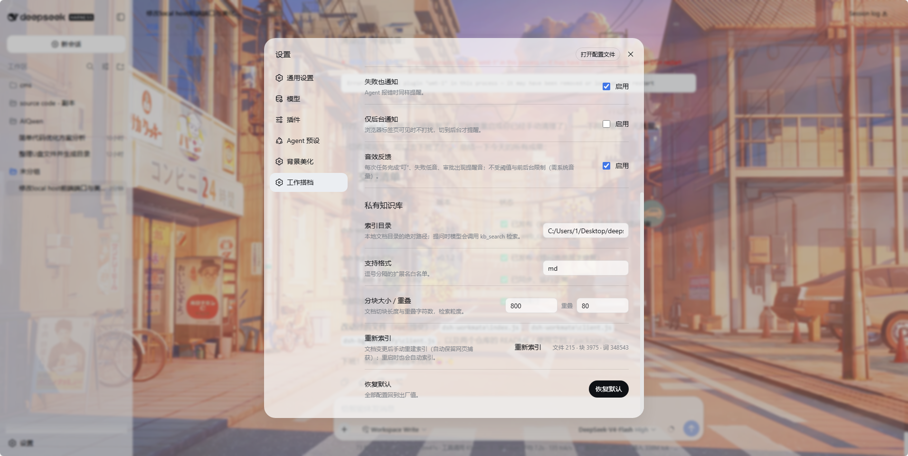
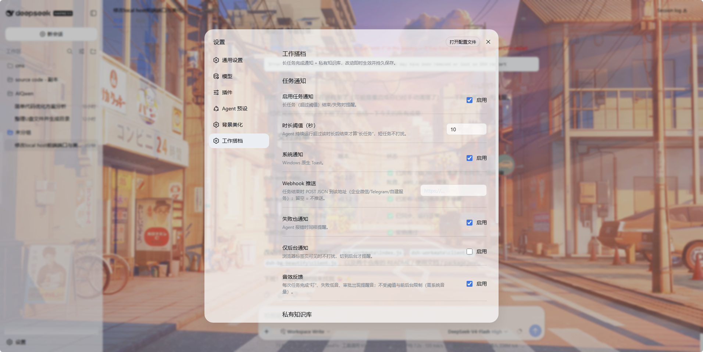

# dsh-workmate 使用与配置文档

> DeepSeek Harness 工作搭档插件：**任务完成通知** + **私有知识库**，host 半边实现，设置页可视化配置，不改任何源码。

- 包名：`dsh-workmate`（中文：工作搭档）
- 作者：芝麻 (halosb) <i@halosb.com> · MIT
- 版本：v0.2.0

---

## 一、功能总览

| 功能 | 做什么 | 谁实现 |
|---|---|---|
| **任务完成通知** | 长任务（Agent 持续运行超过阈值）结束/失败时，弹系统通知或推送 Webhook | host 半边监听 `agent/status` |
| **音效反馈** | 任务完成"叮"、失败低音、审批出现提醒音、提问表单出现提示音 | host 半边 Beep |
| **私有知识库** | 索引本地文档目录 + 收藏网页，提问时模型通过 `kb_search`/`kb_recent` 工具检索 | host 半边索引 + 模型工具 |

两者共用：一个设置页分区、一套 `config.json` 持久化、一组 host 路由（与 dsh-bg-beautify 同款架构）。

**效果预览**（设置页 → 工作搭档）：





---

## 二、安装

```powershell
# 已安装的 dsh CLI（npm 全局 / npx）
dsh plugin --profile web add github:halosb/dsh-workmate

# 源码运行环境（deepseek-harness checkout 内，命令前加 pnpm）
pnpm dsh plugin --profile web add github:halosb/dsh-workmate

# 或本地目录（两种环境都可以，路径按实际情况写）
dsh plugin --profile web add ./dsh-workmate
pnpm dsh plugin --profile web add ./dsh-workmate

# 装完必须重启（默认端口 3080）
dsh web
pnpm dsh web
```

卸载：

```powershell
dsh plugin --profile web remove dsh-workmate
pnpm dsh plugin --profile web remove dsh-workmate
```

> 纯 JS、无构建步骤；Windows 系统通知使用 PowerShell 原生 Toast，无需额外依赖。

---

## 三、设置页（配置）

打开 Web UI → **设置 → 工作搭档**，两个分组：

### 3.1 任务通知

| 设置 | 类型 | 默认 | 说明 |
|---|---|---|---|
| 启用任务通知 | 开关 | 开 | 总开关 |
| 时长阈值（秒） | 数字 | 60 | Agent 持续运行**超过**该秒数后结束，才视为"长任务"；短任务不打扰 |
| 系统通知 | 开关 | 开 | Windows 原生 Toast；弹窗标题=会话标题/工作区名，正文=耗时与状态 |
| Webhook 推送 | 文本 | 空 | 填 URL 后，任务结束时 POST JSON 到该地址（可用于企业微信/Telegram/自建服务/邮箱网关） |
| 失败也通知 | 开关 | 开 | `agent/error` 时同样提醒（正文标注失败） |
| 只在后台通知 | 开关 | 开 | 页面处于前台（浏览器标签可见）时不打扰，仅后台完成才提醒 |
| 音效反馈 | 开关 | 开 | 任务完成"叮"、失败低音、审批出现提醒音、**AI 提问表单出现提示音**（PowerShell Beep，需系统音量） |

**Webhook 请求体**（`POST`，`Content-Type: application/json`）：

```json
{
  "sessionId": "…",
  "title": "会话标题",
  "status": "done" | "error",
  "durationMs": 132000,
  "turn": 3,
  "message": "任务完成，用时 2 分 12 秒"
}
```

### 3.2 私有知识库

| 设置 | 类型 | 默认 | 说明 |
|---|---|---|---|
| 索引目录 | 文本 | 空 | 本地文档目录的绝对路径，如 `D:\docs` 或 `C:\Users\me\notes` |
| 支持格式 | 文本 | txt/md/json/yaml/js/ts | 逗号分隔的扩展名白名单；二进制/图片自动跳过 |
| 分块大小（字符） | 数字 | 1000 | 文档切块长度，越大单块信息越多、检索粒度越粗 |
| 分块重叠（字符） | 数字 | 100 | 相邻块重叠，避免切在句子中间丢信息 |
| 重新索引 | 按钮 | — | 手动触发全量重扫；**自动合并保留网页捕获**，点击后显示"索引中…"，完成后显示统计 |
| 索引统计 | 只读 | — | 文件数 / 块数 / 词数 / 最后索引时间 |

### 3.3 模型工具

| 工具 | 用途 |
|---|---|
| `kb_search(query)` | 检索知识库，返回匹配块（文件/片段/分数）；提问涉及自己的文档时模型自动调用 |
| `web_capture(url)` | 抓取网页正文并入库（`doc` 前缀 `web: 标题 (URL)`），返回**索引文件位置**与取回方式；之后可被 `kb_search`/`kb_recent` 检索 |
| `kb_recent(limit?)` | **直接列出**最近捕获的网页（标题/URL/块数/时间，最新在前），无需模糊搜索 |

### 3.4 恢复默认

一键把以上配置恢复出厂值。

---

## 四、使用

### 4.1 任务通知

1. 在设置页确认「启用任务通知」「系统通知」「音效反馈」已打开，阈值按你的习惯设（默认 60 秒）。
2. 正常发任务即可——**短任务自动忽略**，只有跑了足够久的任务结束/失败才提醒。
3. 完成时：Windows 右下角弹 Toast + 提示音"叮"；失败弹低音；配了 Webhook 的还会收到一条 JSON 推送。
4. AI 向你提问（多选/复选/选项表单）时也会响起提示音，不会错过。
5. 浏览器标签保持前台时默认不打扰（可关掉「只在后台通知」）。

> 适合：跑长分析、批量处理、workflow 大型任务时切去干别的事，回来不用盯着。

### 4.2 私有知识库

1. 设置页填「索引目录」→ 点「重新索引」，等统计出现。
2. 正常提问即可——**模型会自动调用 `kb_search(query)` 工具**从你的文档里检索相关内容再作答。
3. 也可以手动引导："在我的知识库里找一下 XXX 的配置"。
4. 文档更新后，到设置页重新索引。
5. 想收藏网页：让模型执行 `web_capture(url)`（或说"把这篇网页存进知识库"），正文自动分块入库。
6. 想知道存过哪些网页：直接问模型"我存了哪些网页"——模型调用 **`kb_recent`** 直接列出，不用猜关键词。

**重建与网页库的关系**：本地目录"重新索引"是全量重扫本地文件，但**会自动合并保留**之前 `web_capture` 抓的所有网页（`web:` 前缀块），两者互不覆盖、重建不丢。

**检索方式**：本地词频/BM25 关键词打分，**完全离线**、不依赖 embedding 模型、不把文档发给任何服务；适合代码、笔记、配置类资料。语义检索（向量）在路线图中。

---

## 五、配置文件字段（`config.json`）

由设置页写入，字段与说明：

| 字段 | 类型 | 默认 | 说明 |
|---|---|---|---|
| `notifyEnabled` | boolean | true | 任务通知总开关 |
| `notifyMinDurationMs` | number | 60000 | 长任务阈值（毫秒） |
| `notifySystem` | boolean | true | Windows 系统通知 |
| `notifyWebhook` | string | '' | Webhook URL（空=不推送） |
| `notifyOnError` | boolean | true | 失败也通知 |
| `notifyBackgroundOnly` | boolean | true | 仅后台时通知 |
| `soundEnabled` | boolean | true | 音效反馈（完成叮 / 失败低音 / 审批提醒 / 提问提示） |
| `kbDir` | string | '' | 知识库目录 |
| `kbExtensions` | string | 'txt,md,json,yaml,js,ts' | 扩展名白名单 |
| `kbChunkSize` | number | 1000 | 分块大小 |
| `kbOverlap` | number | 100 | 分块重叠 |

> 索引数据单独存 `kb-index.json`（插件目录，已 gitignore），`config.json` 只放配置。

---

## 六、常见问题

| 现象 | 处理 |
|---|---|
| 系统通知不弹 | Windows 通知权限被关（设置→系统→通知→允许 dsh）；或任务耗时没超过阈值 |
| Webhook 没收到 | 检查 URL 可访问、任务确实超阈值；Network 面板看 `POST /wf/settings` 是否 200 |
| 知识库检索不到 | 目录路径不存在/无权访问；扩展名不在白名单；改了文档没重新索引 |
| 重新索引后网页捕获没了 | v0.2.0 起不会：重建自动合并保留 `web:` 网页块；若仍异常请反馈作者 |
| 大目录索引慢 | 全量扫描，建议目录控制在几千个文件内；增量索引在路线图中 |
| 改配置不生效 | 设置页即时生效；若手动改 config.json 需重启 |

---

## 七、路线图（v2+）

- 通知通道：SMTP 邮件、Telegram / 企业微信机器人、飞书
- 知识库：目录变更自动增量索引、支持 PDF/Word、可选的 embedding 语义检索
- 通知触发扩展：`workflow/end`、`subagent/end`（长 workflow/子代理完成也提醒）
- 通知内容：带最后一条回复摘要

---

## 八、反馈

📮 i@halosb.com（芝麻 halosb）
